# TORPEDO NFT series - smartBCH Non-Fungible Token

## Living on Bitcoin Cash blockchain (smartBCH network)

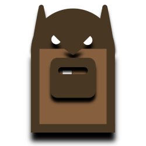 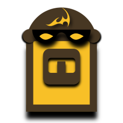 

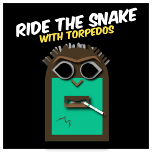 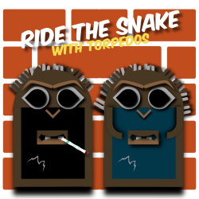

_Scroll down to see all Torpedos._

## _Torpedos are friendly creatures, but they attack when they are hungry._

`Contract id: 0x74d731274c6c4ce78e070357160255a2596da71d`

## Marketplace (works best on desktop)

[Torpedo smartBCH NFT Marketplace](https://ba.net/torpedo)

[TORPEDO NFT Wallet Manager](https://ba.net/torpedo/nft/wallet.html) - check your TORPEDO NFT collectible id

[Sell your TORPEDO NFT](https://ba.net/torpedo/sell.html)

[Check TORPEDO NFT listing](https://ba.net/torpedo) - paste your (seller) address in the seller account field

[Share a link to your TORPEDO NFT for sale](https://ba.net/torpedo/share.html?seller=0xA891fd056eBDD4b90b05Ef319b15f8C275B9671e) - replace 0x... with your addrres

[Cancel sale](https://ba.net/torpedo/cancel.html) - you might not need it, you can just buy back your nft. However if you decide to cancel, you need to click "buy" on your own token first and copy order id and then paste it to cancel form

[TORPEDO NFT exchange address](https://www.smartscan.cash/address/0x4DF941C3356DA878D07E18906fCcd4FBc48eeD58)

smartBCH [explorer](https://www.smartscan.cash/address/0x74d731274C6c4ce78E070357160255A2596DA71d)

Torpedo images and metadata are stored on IPS. Thumbnails are stored on Github

_This is not an investment advice or recommendation. You are purchasing NFT (Non-Fungible Token), but not an image/artwork attached to the token. You can resell TORPEDO NFT, and use images for non-commercial purposes._

## Wallet

Use MetaMask mobile app to see NFT images

Add smartBCH network in MetaMask

```
Network name: SmartBCH
RPC URL: https://smartbch.greyh.at
or
https://smartbch.fountainhead.cash/mainnet
or
https://global.uat.cash
Chain ID: 10000
Currency Symbol: BCH
```

- Add the token as usual - „+ Add tokens”, paste TORPEDO NFT contract id, but type manually token symbol (TORPEDO) and set decimals 0

- Go to NFTs tab and tap „+ Add NFTs”, then paste contract id again and type colectible id (TORPEDO NFT collectible ids are 1, 2, 3, 4, …, 230). You might need to tap „Add” twice

- To send NFTs you need to do it from the NFT tab. Set gas price to 1.047 gwei

---------------------------------------------------------------------

### TORPEDO Generation 1

10 groups, 10 Torpedos in each group.


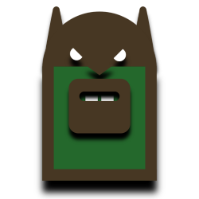
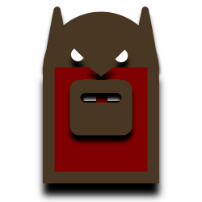
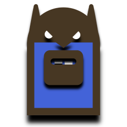
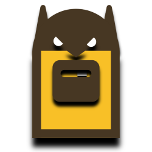
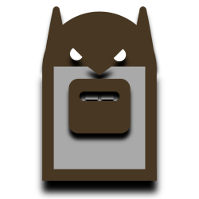

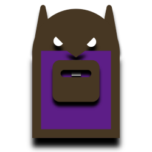
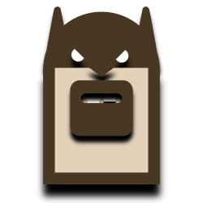


### TORPEDO Generation 2

10 groups, 10 Torpedos in each group.

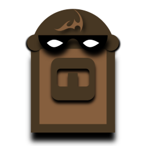
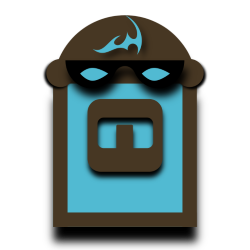
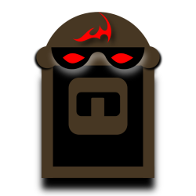
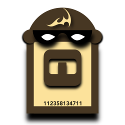
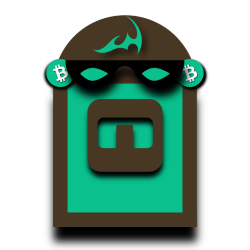

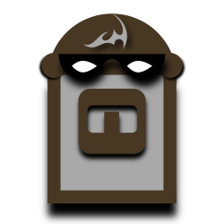
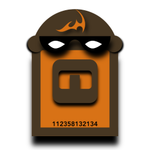
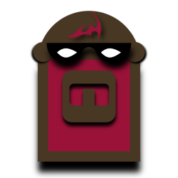
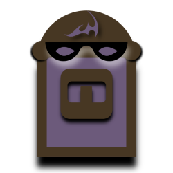

### TORPEDO Special Edition


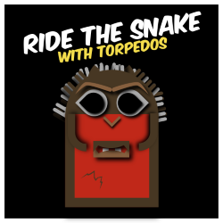

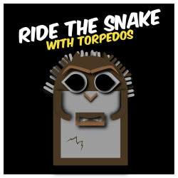
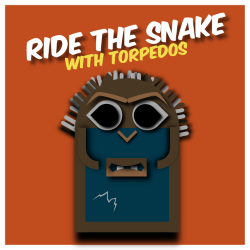


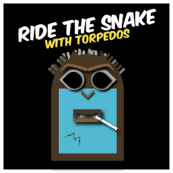
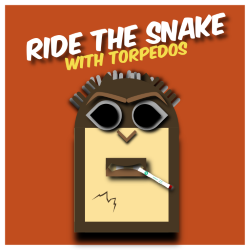

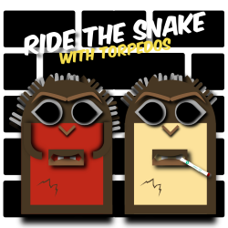
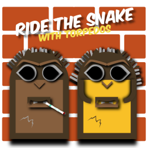
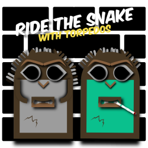
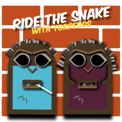

---------------------------------------------------------------------

Powered by [MAZE Token](https://mazetoken.github.io)


Telegram [group](https://t.me/mazetokens)

Torpedo [Github](https://github.com/mazetoken/torpedoNFT) repository

Special thanks to [Ba.net](https://ba.net)

Donation for Torpedo food:

```
smartBCH: 0xA891fd056eBDD4b90b05Ef319b15f8C275B9671e
Bitcoin Cash: bitcoincash:qz85j4w64z7n3vjfztwdhnstv7w98yztksmfwd4vu0
SLP: simpleledger:qz85j4w64z7n3vjfztwdhnstv7w98yztkshj9kqvz3
```