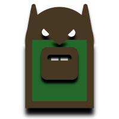
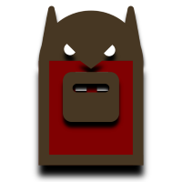
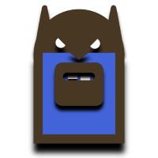
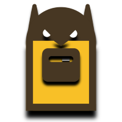
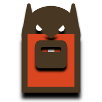
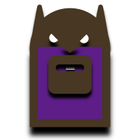
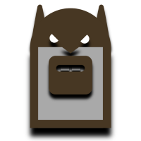
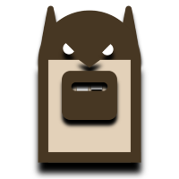
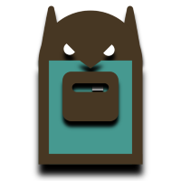

# TORPEDO NFT

## Bitcoin Cash smartBCH Non-Fungible Tokens

_Torpedos are friendly creatures, but they can attack when they are hungry._

`Contract id: 0x74d731274c6c4ce78e070357160255a2596da71d`

smartBCH [explorer](https://www.smartscan.cash/address/0x74d731274C6c4ce78E070357160255A2596DA71d)

### TORPEDO Generation 1

10 groups, 10 Torpedos in each group.

Collect them. More to come ...












### TORPEDO Generation 2 is coming soon

## Marketplace

[Torpedo smartBCH NFT Marketplace](https://torpedonft.herokuapp.com)

or

[Torpedo smartBCH NFT Marketplace](https://mazetoken.github.io/torpedoNFT)


Torpedo NFT images are stored on [IPFS](https://ipfs.io) 

_This is not an investment advice or recommendation. You are purchasing NFT (Non-Fungible Token), but not an image/artwork attached to the token. You can resell TORPEDO NFT, and use images for non-commercial purposes. Ask [ba.net](https://ba.net) if you want to use the marketplace code._

## Wallet

Use MetaMask mobile app

Add smartBCH network in MetaMask

```
Network name: SmartBCH
RPC URL: https://smartbch.greyh.at
or
https://smartbch.fountainhead.cash/mainnet
or
https://global.uat.cash
Chain ID: 10000
Currency Symbol: BCH
```

- Add the token as usual - „+ Add tokens”, paste TORPEDO NFT contract id, but type manually token symbol (TORPEDO) and set decimals 0

- Go to NFTs tab and tap „+ Add NFTs”, then paste contract id again and type colectible id (TORPEDO NFT collectible ids are 1, 2, 3, 4, …, 100). You might need to tap „Add” twice

- To send NFTs you need to do it from the NFT tab. Set gas proce to 1.047 gwei

---------------------------------------------------------------------

Powered by [MAZE Token](https://mazetoken.github.io)

Telegram [group](https://t.me/mazetokens)

Donation for Torpedo food:

```
smartBCH: 0xD125bFC36ac15ED0ADb9C545A3a3D9c213D01D41
Bitcoin Cash: bitcoincash:qz85j4w64z7n3vjfztwdhnstv7w98yztksmfwd4vu0
SLP: simpleledger:qz85j4w64z7n3vjfztwdhnstv7w98yztkshj9kqvz3
```